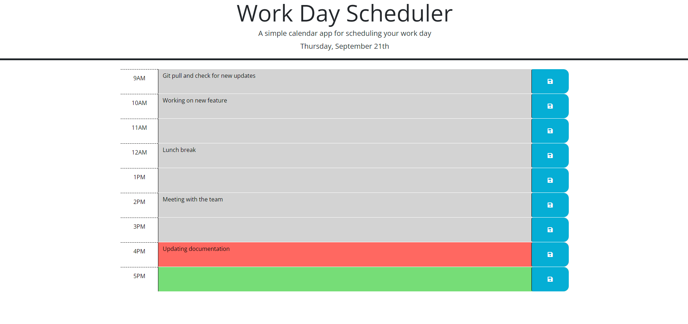
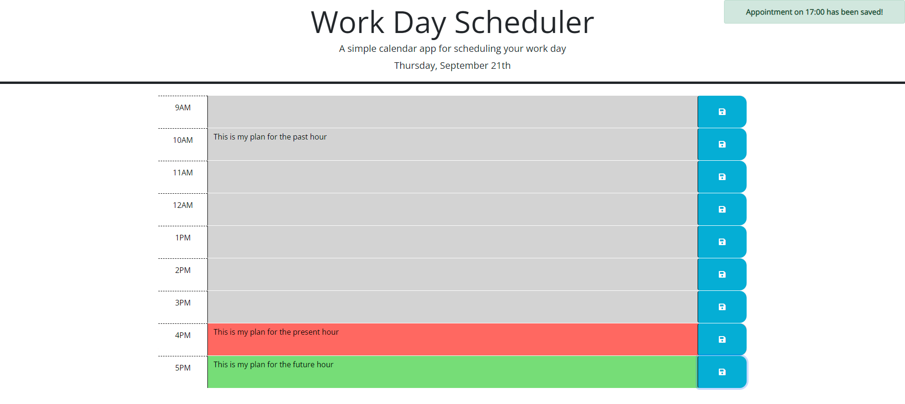

# JavaScript Quiz
(You can access our deployed website here: https://honguyen00.github.io/daily-planner/)

## Description

The aim of this project is to build a simple planner that save all users' plans for their working hours. Users can manipulate the planner by adding, updating and deleting plans and any plans that have been saved will be stored to local storage. Plans will be saved and displayed even when users leave the site and comeback, or refresh the site.

## Installation

N/A

## Usage
This is the look of the planner on landing the page. Any plans that have been saved before will be displayed here  

Our planner is divided in rows with each row representing for each hour. By using dayjs, any rows that have hours in the past will be in grey, hour in the present will be in red and hours in the future will be in green. To update the planner, users need to input their plan onto the corresponding hour row and click on the save button.

